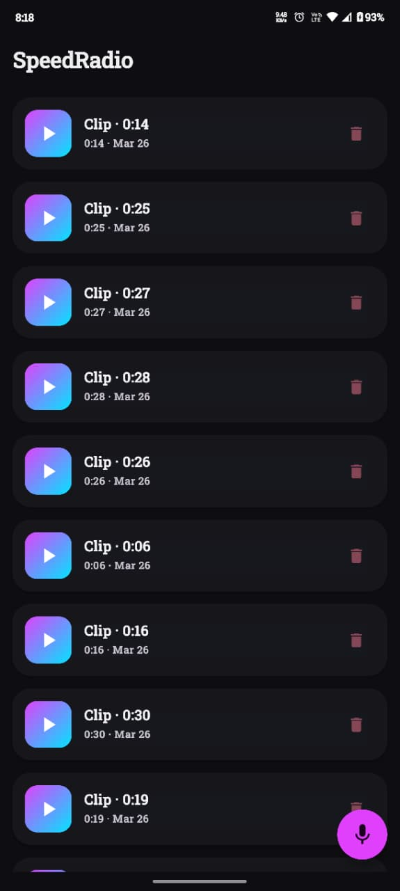
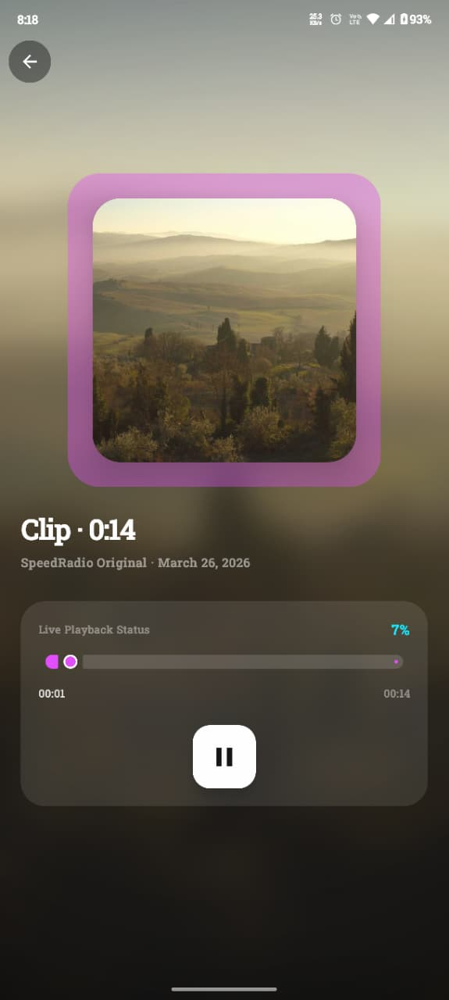
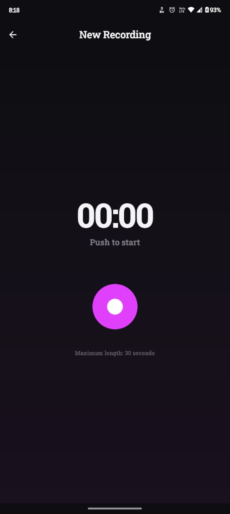
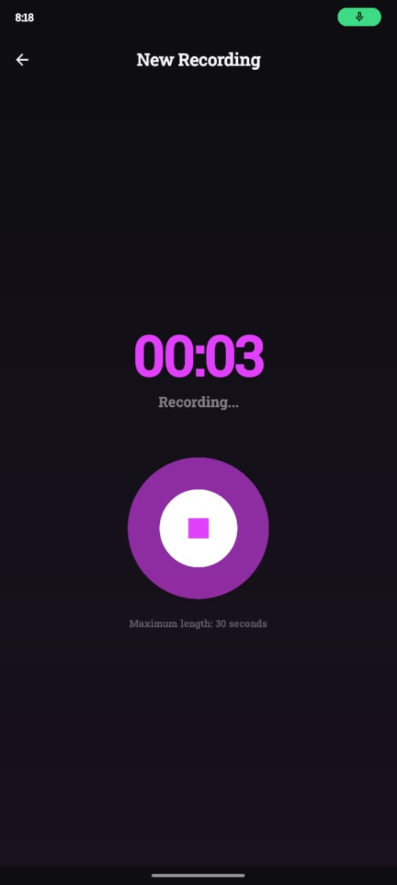

# SpeedRadio 🎙️

An **Audio-First Social Feed** Android app built with Jetpack Compose, MVVM, Hilt, and ExoPlayer (Media3).  
Record short audio clips (max 30 seconds), browse them in a paginated list, and enjoy a TikTok-style **Full-Screen Vertical Player** with persistent background playback and MediaStyle notifications.

---

## Screenshots

<table>
  <tr>
    <td align="center"><b>Feed Screen</b></td>
    <td align="center"><b>Full-Screen Player</b></td>
    <td align="center"><b>Record — Idle</b></td>
    <td align="center"><b>Record — Active</b></td>
  </tr>
  <tr>
    <td></td>
    <td></td>
    <td></td>
    <td></td>
  </tr>
  <tr>
    <td align="center">Paginated audio list with gradient play icons</td>
    <td align="center">Glassmorphic player with blurred backdrop & seek control</td>
    <td align="center">Animated mic button, 30s timer, push to start</td>
    <td align="center">Pulsing ring animation while recording in progress</td>
  </tr>
</table>

---

## Project Structure

```
app/src/main/java/com/speedradio/app/
├── SpeedRadioApp.kt               ← @HiltAndroidApp entry point
├── MainActivity.kt                ← Single activity, handles POST_NOTIFICATIONS permission
├── data/
│   ├── SpeedRadioDatabase.kt      ← Room DB + AudioPostDao (with PagingSource)
│   └── AudioRepository.kt        ← Paging 3 + Flow backed data source
├── domain/
│   └── AudioPost.kt              ← Core data model (Room Entity)
├── player/
│   ├── AudioPlayerManager.kt     ← Singleton ExoPlayer wrapper with StateFlow
│   └── PlaybackService.kt        ← MediaSessionService (Foreground Service + Notification)
├── di/
│   └── AppModule.kt              ← Hilt providers for DB, Repository, PlayerManager
├── viewmodel/
│   ├── FeedViewModel.kt          ← Paged list state & feed interactions
│   ├── PlayerViewModel.kt        ← Full-screen playback logic
│   └── RecordViewModel.kt        ← MediaRecorder lifecycle + elapsed timer
└── ui/
    ├── theme/Theme.kt            ← Dark mode with Cyber Cyan + Vibrant Purple palette
    ├── navigation/AppNavGraph.kt ← Animated screen transitions (Slide/Fade/Scale)
    ├── feed/
    │   ├── FeedScreen.kt         ← Paging 3 LazyColumn feed
    │   └── WaveformAnimation.kt  ← Animated music visualizer bars
    ├── player/
    │   └── PlayerScreen.kt       ← Full-screen VerticalPager player (glassmorphic)
    └── record/
        └── RecordScreen.kt       ← Mic recording UI with animated pulse button
```

---

## Tech Stack

| Layer | Technology |
|---|---|
| **Language** | Kotlin 2.0.21 |
| **UI** | Jetpack Compose (BOM 2024.09.03) |
| **Architecture** | MVVM + Hilt DI |
| **Player** | Media3 ExoPlayer 1.4.1 |
| **Background Playback** | Media3 `MediaSessionService` |
| **Database** | Room 2.6.1 |
| **Pagination** | Paging 3 (3.3.2) with Room PagingSource |
| **Image Loading** | Coil 2.7.0 |
| **Coroutines** | Kotlinx Coroutines 1.8.1 |
| **Min SDK** | 26 (Android 8.0) |
| **Target SDK** | 35 (Android 15) |

---

## Core Features & Architecture

### 1. Full-Screen Vertical Player
- **Trigger**: Tapping any item in the feed opens the full-screen player at the selected index.
- **Vertical Swipe**: Uses `VerticalPager` to switch between audio items.
- **Auto-Play on Scroll**: `snapshotFlow { pagerState.currentPage }` inside `LaunchedEffect` detects page changes and calls `playerManager.play()` automatically.
- **Haptic Feedback**: A `TextHandleMove` vibration fires on every swipe to a new track, giving a tactile "radio dial" sensation.

### 2. Media Notification (MediaStyle)
- **Foreground Service**: `PlaybackService` extends `MediaSessionService` with `foregroundServiceType="mediaPlayback"`.
- **Key `addSession()` Call**: After building the `MediaSession`, `addSession(session)` is explicitly called. Without this, Media3's `MediaNotificationManager` is never notified and no notification appears.
- **Correct `onCreate()` Order**:
  1. `createNotificationChannel()` — must exist before any notification is posted
  2. `super.onCreate()` — triggers Hilt field injection
  3. `setMediaNotificationProvider()` — configure channel ID, icon, notification ID
  4. `buildAndRegisterSession()` + `addSession()` — wire up the player to the notification system
- **Session Activity**: Tapping the notification re-opens `MainActivity`.
- **Stop on Task Remove**: Service checks `playWhenReady` in `onTaskRemoved()` and calls `stopSelf()` if the user force-closes.

### 3. Singleton Player Architecture
- `AudioPlayerManager` is a `@Singleton` provided by Hilt.
- Both the `PlaybackService` and all ViewModels share the **same `ExoPlayer` instance**.
- `startService()` (not `startForegroundService()`) is used intentionally — since play is triggered from the foreground UI, plain `startService` is legal and avoids the `ForegroundServiceDidNotStartInTimeException` crash caused by buffering delays.

### 4. Paging 3 Feed List
- **DAO**: `getAllPostsPaged()` returns `PagingSource<Int, AudioPost>` from Room.
- **Repository**: Wraps a `Pager` with `pageSize = 10`.
- **ViewModel**: Uses `cachedIn(viewModelScope)` so pagination state survives rotation.
- **UI**: `collectAsLazyPagingItems()` + `items(count, key)` in `LazyColumn`.
- **Dependencies**: `room-paging`, `paging-runtime`, `paging-compose` all required.

### 5. Haptic Feedback System
Haptic feedback is applied across all major interactions using `LocalHapticFeedback`:

| Interaction | Haptic Type |
|---|---|
| Tap feed item to open player | `TextHandleMove` (light tick) |
| Delete audio post | `LongPress` (heavy thud) |
| Open record screen (FAB) | `LongPress` |
| Press record/stop button | `LongPress` |
| Play/pause in player | `LongPress` |
| Seek slider release | `TextHandleMove` |
| Swipe to next track in pager | `TextHandleMove` |
| Back navigation | `TextHandleMove` |

### 6. Permissions
| Permission | Purpose | When Requested |
|---|---|---|
| `RECORD_AUDIO` | Microphone access for MediaRecorder | Runtime — on first record tap via `rememberLauncherForActivityResult` |
| `POST_NOTIFICATIONS` | Show media playback notification (Android 13+) | On app launch in `MainActivity` |
| `FOREGROUND_SERVICE` | Allow foreground service | Manifest only |
| `FOREGROUND_SERVICE_MEDIA_PLAYBACK` | Required for mediaPlayback service type | Manifest only |
| `INTERNET` | Future remote streaming support | Manifest only |

### 7. UI & Design System
- **Theme**: Dark mode with `Cyber Cyan` (`#00E5FF`) primary and `Vibrant Purple` secondary.
- **Fonts**: System default with custom weight hierarchy (Black, Bold, SemiBold).
- **Transitions**: Custom `AnimatedNavHost` with Slide+Fade enter/exit transitions.
- **No White Flash**: `windowBackground` set to deep charcoal in `themes.xml`; root `Surface` in `MainActivity`.
- **Player**: Glassmorphic full-screen player with blurred backdrop, glowing artwork, and a frosted glass progress control panel.
- **Feed Cards**: Pulse scale animation on currently playing card; gradient thumbnail icon.

---

## Key Architectural Decisions & Tradeoffs

| Decision | Rationale |
|---|---|
| `startService()` instead of `startForegroundService()` | Avoids `ForegroundServiceDidNotStartInTimeException` when ExoPlayer buffers before the 5s OS deadline |
| ExoPlayer owned by `AudioPlayerManager` (not Service) | Easier state sharing between UI & Service; service simply wraps the shared player in a `MediaSession` |
| `addSession()` explicit call | Required by Media3 API — without it the notification never appears |
| Paging 3 over plain `Flow<List>` | Efficient memory use at scale; Room PagingSource only loads visible items |
| Runtime permission for microphone | Prevents crash on first launch; graceful UX via in-flow permission dialog |
| `collectAsStateWithLifecycle` everywhere | Stops collecting state when UI is not visible, preventing wasted computation |

---

## Known Issues & Future Work

| Item | Notes |
|---|---|
| **Audio Focus** | No ducking/pausing on phone calls. Implement `AudioFocusRequest` in `AudioPlayerManager`. |
| **Remote Streaming** | Architecture is ready — swap `item.filePath` with remote HLS/DASH URL in `AudioPlayerManager.play()` |
| **Real-time Amplitude** | Record screen uses static pulse; connect `MediaRecorder.maxAmplitude` for a live waveform meter |
| **Next/Prev from Notification** | `playNext()` / `playPrevious()` exist in `AudioPlayerManager`; queue must be set before background use |
| **AGP Version** | AGP 8.5.2 is tested up to compileSdk 34; update to 8.7+ for full SDK 35 support |

---

## Development Setup

```bash
# Clone the repository
git clone <repo-url>
cd speedradio

# Open in Android Studio (Hedgehog or newer recommended)
# Set ANDROID_HOME if building from terminal:
export ANDROID_HOME=/Users/<you>/Library/Android/sdk

# Build debug APK
./gradlew assembleDebug

# Install on connected device/emulator
./gradlew installDebug
```

> **Note**: If you see `INSTALL_FAILED_UPDATE_INCOMPATIBLE`, uninstall the existing app on the device first: `adb uninstall com.speedradio.app`

---

## Debugging Media Notifications

Filter Logcat by `MEDIA_DEBUG` to trace the full notification lifecycle:

```
MEDIA_DEBUG  startService called
MEDIA_DEBUG  Notification channel created: speedradio_playback_channel
MEDIA_DEBUG  MediaSession built & registered, id=...
MEDIA_DEBUG  PlaybackService onCreate complete
MEDIA_DEBUG  PlaybackService onStartCommand
MEDIA_DEBUG  PlaybackService onGetSession          ← confirms external controller connected
MEDIA_DEBUG  onUpdateNotification: startInForeground=true isPlaying=true state=3  ← notification posted!
```

If `onUpdateNotification` never fires, check that:
1. `addSession()` is called after `buildAndRegisterSession()`
2. The notification channel exists with `IMPORTANCE_LOW` or higher
3. `POST_NOTIFICATIONS` permission is granted on Android 13+
4. The audio file path is valid and ExoPlayer can actually play it

---

## Data Flow

SpeedRadio has three primary data flows. All share the singleton `AudioPlayerManager` and Room DB as the single source of truth.

---

### Flow 1 — Recording an Audio Clip

```
User taps Record Button
        │
        ▼
[RecordScreen]  ── checks RECORD_AUDIO permission
        │  not granted → rememberLauncherForActivityResult → System Permission Dialog
        │  granted ↓
        ▼
[RecordViewModel.startRecording()]
     creates File: context.filesDir/audio_<ts>.m4a
     configures MediaRecorder (AAC, 128kbps, 44.1kHz, max 30s)
     MediaRecorder.start()
     starts 1s coroutine timer
        │
        ▼
[RecordUiState] ← MutableStateFlow
        │ isRecording=true, elapsedSeconds++
        ▼
[RecordScreen] recomposes → timer display + pulse animation

        │ User taps Stop (or 30s auto-stop)
        ▼
[RecordViewModel.stopRecording()]
     MediaRecorder.stop() + release()
     builds AudioPost(id=UUID, title="Clip · 0:12", filePath, durationMs)
        │
        ▼
[AudioRepository.insertPost()] → Room DAO → audio_posts table
        │
        ▼ Room PagingSource auto-invalidated
[FeedViewModel.pagedPosts] refreshes → new card appears in FeedScreen
```

---

### Flow 2 — Playing Audio from the Feed

```
User taps Feed Card
        │  HapticFeedback.TextHandleMove
        ▼
[AppNavGraph] navigates → PlayerScreen(initialPostId)
        │
        ▼
[PlayerScreen]
  posts ← AudioRepository.posts (full list, StateFlow)
  pagerState = rememberPagerState(initialPage = indexOf(initialPostId))

  LaunchedEffect(pagerState):
    snapshotFlow { currentPage }
      ├── index changed → HapticFeedback.TextHandleMove
      └── viewModel.playPost(posts[index].id)
        │
        ▼
[PlayerViewModel.playPost(postId)]
  repository.getPost(postId)  ← suspend, Room lookup
        │
        ▼
[AudioPlayerManager.play(post, fullQueue)]
  1. context.startService(PlaybackService)   ← ensures service is alive
  2. builds List<MediaItem> with title + artworkUri metadata
  3. player.stop() → setMediaItems() → seekTo(targetIndex) → prepare()
  4. player.play()
        │
        ▼ ExoPlayer buffers asynchronously
[ExoPlayer internal listeners]
  onIsPlayingChanged(true)
    → startProgressPolling() (500ms coroutine)
    → _playbackState.update(isPlaying=true, durationMs)
  onMediaItemTransition(mediaItem)
    → _playbackState.update(currentPostId=mediaItem.mediaId)

        ▼
[AudioPlayerManager._playbackState]  ← SharedFlow (single source of truth)
  ├── FeedViewModel → FeedScreen cards (play/pause icon, pulse scale, waveform)
  └── PlayerViewModel → PlayerScreen (slider position, % label, FAB icon)
```

---

### Flow 3 — Background Playback + Media Notification

```
context.startService(PlaybackService)
        │
        ▼
[PlaybackService.onCreate()] — four ordered steps:
  1. createNotificationChannel(CHANNEL_ID, IMPORTANCE_LOW)
  2. super.onCreate()              ← Hilt injects audioPlayerManager
  3. setMediaNotificationProvider(DefaultMediaNotificationProvider
       .setChannelId / .setNotificationId / .setChannelName)
  4. buildAndRegisterSession()
       MediaSession.Builder(this, audioPlayerManager.player).build()
       addSession(session)    ← CRITICAL: wires session into MediaNotificationManager
        │
        ▼
[MediaNotificationManager] (internal Media3)
  watches MediaSession → watches ExoPlayer state

  ExoPlayer reaches STATE_READY + isPlaying=true
        │
        ▼
  onUpdateNotification(session, startInForegroundRequired=true)
        │
        ▼
  DefaultMediaNotificationProvider builds NotificationCompat:
    MediaStyle (connected to MediaSession token)
    title   ← MediaMetadata.title ("Clip · 0:12")
    artist  ← MediaMetadata.artist ("Clip")
    artwork ← MediaMetadata.artworkUri (Coil loads async from picsum)
    actions ← [Prev] [Play/Pause] [Next]
        │
        ▼
  startForeground(NOTIFICATION_ID, notification)
  ┌─ Notification visible in status bar
  ├─ Lock screen media controls active
  └─ System media session (Bluetooth / headset) connected

  ExoPlayer paused / stopped
        │
        ▼
  onUpdateNotification(session, startInForegroundRequired=false)
  stopForeground(STOP_FOREGROUND_DETACH)  ← dismissible notification

  onTaskRemoved() + !playWhenReady
        │
        ▼
  stopSelf() → onDestroy() → MediaSession.release() → notification gone

System button (headset/BT) press:
  MediaSession receives command → ExoPlayer handles it
  → StateFlow updates → all Compose UI recomposes automatically
```

---

### Data Models

**`AudioPost`** (Room Entity — persisted)
```kotlin
@Entity(tableName = "audio_posts")
data class AudioPost(
    @PrimaryKey val id: String,      // UUID, stable key for Paging
    val title: String,               // "Clip · 0:12"
    val filePath: String,            // absolute path inside context.filesDir
    val durationMs: Long,            // recording length in milliseconds
    val createdAt: Long              // System.currentTimeMillis() — used for DESC sort
)
```

**`PlaybackState`** (in-memory UI state — not persisted)
```kotlin
data class PlaybackState(
    val currentPostId: String? = null,  // maps to AudioPost.id
    val isPlaying: Boolean = false,     // mirrors ExoPlayer.isPlaying
    val positionMs: Long = 0L,          // polled every 500ms during playback
    val durationMs: Long = 0L           // from ExoPlayer.duration when STATE_READY
)
```

**State propagation:**
```
ExoPlayer listener
  └─► AudioPlayerManager._playbackState (MutableStateFlow<PlaybackState>)
        ├─► FeedViewModel.playbackState  (stateIn, WhileSubscribed)
        │     └─► FeedScreen — card icons, waveform, pulse animation
        └─► PlayerViewModel.playbackState (stateIn, WhileSubscribed)
              └─► PlayerScreen — FAB icon, slider value, time labels, % display
```
